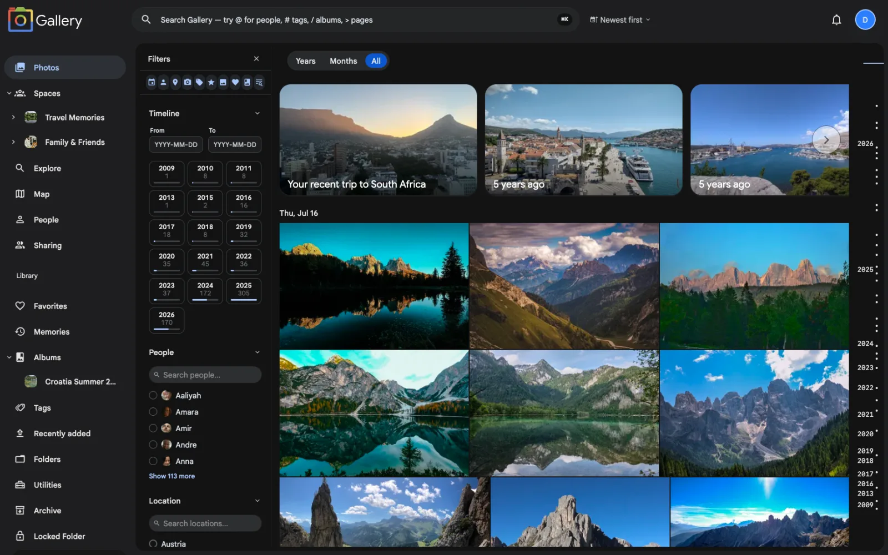

 
   
  
  
   
   

<h3 align="center">Soluzione ad alte prestazioni per la gestione self-hosted di foto e video</h3>
 

 

  <a href="../README.md">English</a>
  <a href="README_ca_ES.md">Català</a>
  <a href="README_es_ES.md">Español</a>
  <a href="README_fr_FR.md">Français</a>
  <a href="README_ja_JP.md">日本語</a>
  <a href="README_ko_KR.md">한국어</a>
  <a href="README_de_DE.md">Deutsch</a>
  <a href="README_nl_NL.md">Nederlands</a>
  <a href="README_tr_TR.md">Türkçe</a>
  <a href="README_zh_CN.md">简体中文</a>
  <a href="README_zh_TW.md">正體中文</a>
  <a href="README_uk_UA.md">Українська</a>
  <a href="README_ru_RU.md">Русский</a>
  <a href="README_bg_BG.md">Български</a>
  <a href="README_pt_BR.md">Português Brasileiro</a>
  <a href="README_sv_SE.md">Svenska</a>
  <a href="README_ar_JO.md">العربية</a>
  <a href="README_th_TH.md">ภาษาไทย</a>
  <a href="README_ml_IN.md">മലയാളം</a>

> [!NOTE]
> Questo è un **fork comunitario** di [Immich](https://github.com/immich-app/immich) con funzionalità aggiuntive. Per le immagini Docker, le istruzioni per il passaggio e l'elenco completo delle modifiche, consulta il [README principale](../README.md).

> [!WARNING]
> ⚠️ Segui sempre la regola di backup [3-2-1](https://www.backblaze.com/blog/the-3-2-1-backup-strategy/) per proteggere i tuoi ricordi e le foto a cui tieni!
>

> [!NOTE]  
> La documentazione principale, comprese le guide all’installazione, si trova su https://opennoodle.de/.  

## Link utili

- [Documentazione](https://docs.opennoodle.de)  
- [Informazioni](https://docs.opennoodle.de/overview/quick-start)  
- [Installazione](https://docs.opennoodle.de/install/requirements)  
- [Roadmap](https://opennoodle.de/roadmap)  
- [Demo](#demo)  
- [Funzionalità](#funzionalità)  
- [Traduzioni](https://docs.opennoodle.de/developer/translations)  
- [Contribuire](https://docs.opennoodle.de/overview/support-the-project)  

## Demo

Accedi alla demo [qui](https://demo.opennoodle.de).  
Per l’app mobile puoi usare `https://demo.opennoodle.de` come `Server Endpoint URL`.  

## Funzionalità

| Funzionalità                                | Mobile | Web |
| :------------------------------------------ | ------ | --- |
| Caricare e visualizzare foto e video        | Sì     | Sì  |
| Backup automatico all’apertura dell’app     | Sì     | N/D |
| Evita la duplicazione dei file              | Sì     | Sì  |
| Backup selettivo di album                   | Sì     | N/D |
| Scaricare foto e video sul dispositivo      | Sì     | Sì  |
| Supporto multi-utente                       | Sì     | Sì  |
| Album e album condivisi                     | Sì     | Sì  |
| Barra di scorrimento trascinabile           | Sì     | Sì  |
| Supporto ai formati RAW                     | Sì     | Sì  |
| Visualizzazione metadati (EXIF, mappa)      | Sì     | Sì  |
| Ricerca per metadati, oggetti, volti, CLIP  | Sì     | Sì  |
| Funzioni amministrative (gestione utenti)   | No     | Sì  |
| Backup in background                        | Sì     | N/D |
| Scorrimento virtuale                        | Sì     | Sì  |
| Supporto OAuth                              | Sì     | Sì  |
| Chiavi API                                  | N/D    | Sì  |
| Backup e riproduzione LivePhoto/MotionPhoto | Sì     | Sì  |
| Supporto immagini a 360°                    | No     | Sì  |
| Struttura di archiviazione personalizzata   | Sì     | Sì  |
| Condivisione pubblica                       | Sì     | Sì  |
| Archivio e preferiti                        | Sì     | Sì  |
| Mappa globale                               | Sì     | Sì  |
| Condivisione con partner                    | Sì     | Sì  |
| Riconoscimento e raggruppamento facciale    | Sì     | Sì  |
| Ricordi (anni fa)                           | Sì     | Sì  |
| Supporto offline                            | Sì     | No  |
| Galleria in sola lettura                    | Sì     | Sì  |
| Foto impilate                               | Sì     | Sì  |
| Tag                                         | No     | Sì  |
| Vista per cartelle                          | Sì     | Sì  |

## Traduzioni

Scopri di più sulle traduzioni [qui](https://docs.opennoodle.de/developer/translations).
